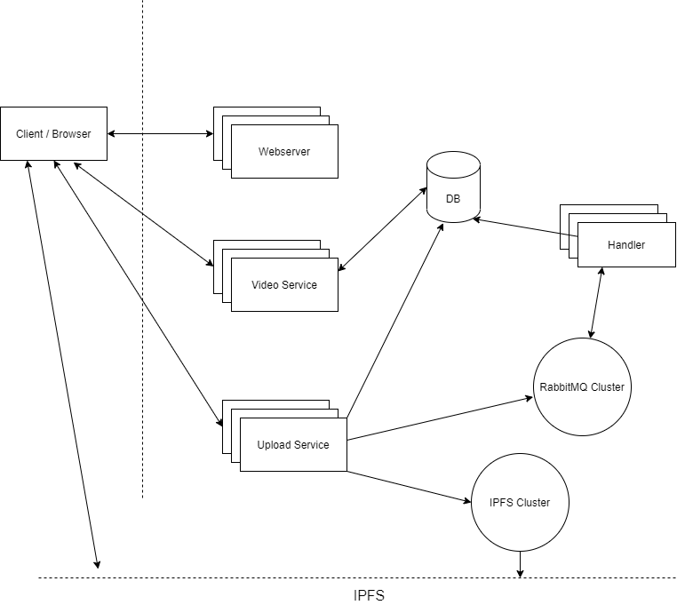
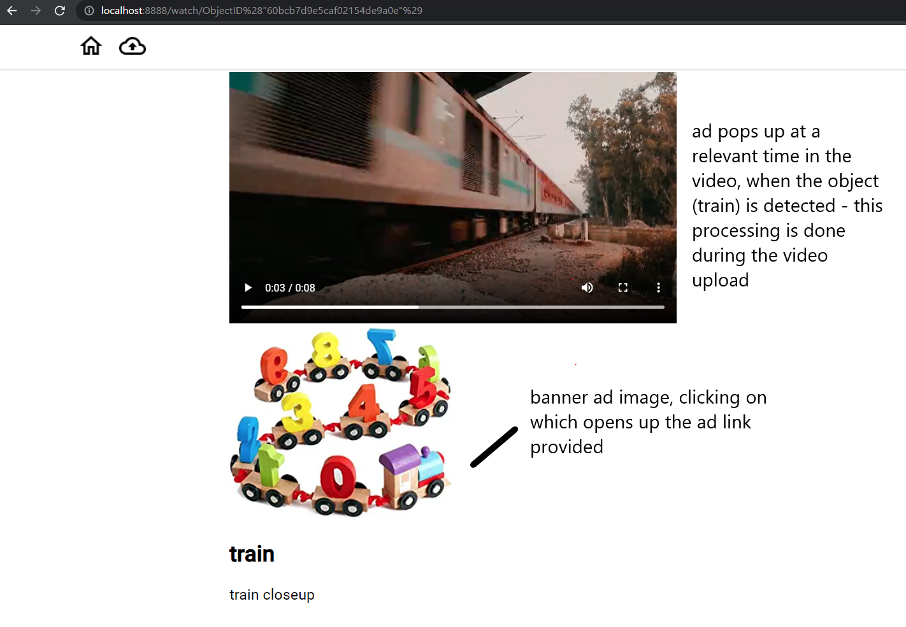
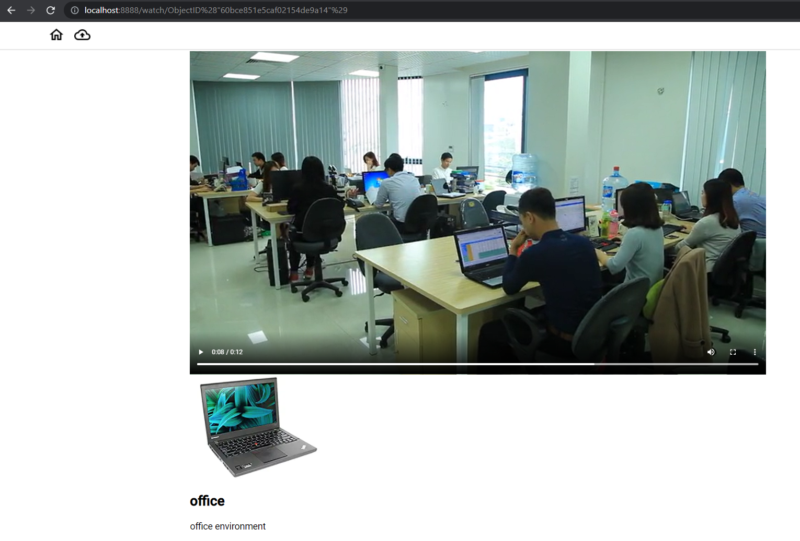

# VP-CAP Design and Architecture

VP-CAP (Video Platform with Content based Ad Placement)

- When users upload videos, the video processing pipeline get the relevant objects and their positions in the video.
- Businesses can upload banner ads and choose which object their ads corresponds to the most.
- When streaming a video, based on the objects in the videos, the ads get matched and are displayed are appropriate positions in the video (where the object was detected and found to be relevant).

Refer repositories for the components for details on each:
- [upload-service](https://github.com/vp-cap/upload-service)
- [video-service](https://github.com/vp-cap/video-service)
- [handler-service](https://github.com/vp-cap/handler-service)
- [frontend](https://github.com/vp-cap/frontend)
- [data-lib](https://github.com/vp-cap/data-lib)

Currently, MongoDB stores 3 tables: for Video, Ad and Video Inference (result after processing by handler). The video itself is stored in IPFS cluster which connects to the [IPFS](https://ipfs.io/) network and thus the client can directly request a video from it (this acts like a CDN).

## Result

Check [Usage.md](USAGE.md) for details on how to run.

## Improvements/Problems

- For this project, a library which seemed to meet the requirement (detecting objects from video) was used. 
    Object detection from videos using ML can be improved or creation of complex pipelines to extract other relevant information like from the audio, using context of multiple video frames, etc. 

- DB may become a bottleneck as all service would send their requests.
    Possible solutions: increase cluster size of db or multiple/partitioned db?

- Videos submitted for processing can be indefinitely stuck in the current design - if the handler fails abruptly without updating the status
    Have another service to regularly check if the processing time has crossed a threshold, and resubmit for processing

